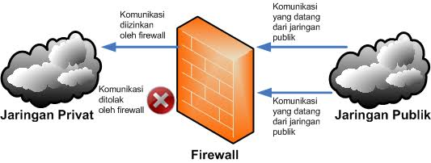
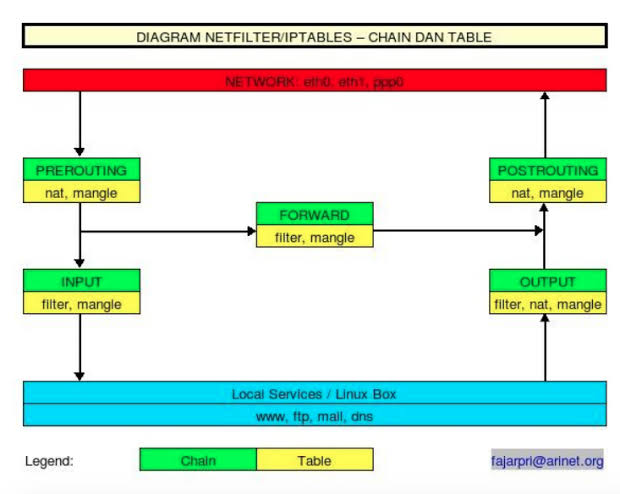

# FIREWALL

1. [Definisi](#1-definisi)
2. [Fungsi Firewall](#2-fungsi-firewall)
3. [Cara kerja Firewall](#3-cara-kerja-firewall)
4. [Jenis-jenis Firewall](#4-jenis-jenis-firewall)
5. [IPTables](#5-iptables)


#

### 1. Definisi
Firewall adalah sebuah sistem keamanan pada jaringan komputer yang digunakan untuk melindungi suatu komputer dari beberapa jenis serangan dari komputer luar berdasarkan aturan keamanan (_security rules_) yang telah ditentukan. 

Menurut Wikipedia Firewall adalah tembok api, tembok pelindung, atau dinding api yang merupakan suatu sistem yang dirancang untuk mencegah akses yang tidak di inginkan dari atau kedalam suatu jaringan internal.

### 2. Fungsi Firewall
Firewall diperlukan karena keamanan, diantara pertimbangan adanya firewall adalah:

- Pencurian data pada jaringan internal
- Pengaksesan data oleh orang yang tidak berhak
- Denial of Service

### 3. Cara Kerja Firewall
 

Gambar ilustrasi Firewall (Sumber: https://id.wikipedia.org/wiki/Berkas:Ilustrasi-Firewall.png)

Firewall adalah suatu mekanisme untuk melindungi keamanan jaringan komputer dengan mengizinkan lalu lintas jaringan yang dianggap aman untuk melaluinya dan mencegah lalu lintas jaringan yang tidak aman. Pengaturan lalu lintas paket tersebut berupa menyaring paket data yang keluar dan masuk di jaringan. 

Paket data yang ’baik’ diperbolehkan untuk melewati jaringan dan paket yang dianggap ’jahat’ tidak diperbolehkan melewati jaringan. Firewall dapat berupa perangkat lunak atau perangkat keras yang ditanam perangkat lunak untuk memfilter paket data. Umumnya, sebuah firewall diimplementasikan dalam sebuah mesin terdedikasi, yang berjalan pada pintu gerbang (gateway) antara jaringan lokal (suatu subnet) dan jaringan (subnet) lainnya. Firewall umumnya juga digunakan untuk mengontrol akses terhadap siapa saja yang memiliki akses terhadap jaringan pribadi dari pihak luar.

Cara-cara firewall dalam melindungi jaringan komputer internal, antara lain :

- Menolak dan memblokir paket data yang datang berdasarkan sumber dan tujuan yang tidak diinginkan.
- Menolak dan menyaring paket data yang berasal dari jaringan internal ke internet. Misal, ketika ada pengguna jaringan internet akan mengakses situs yang tidak baik.
- Menolak dan menyaring paket data berdasakan konten yang tidak diinginkan. Misal, firewall yang terintegrasi pada suatu antivirus akan menyaring dan mencegah file yang sudah terjangkit virus memasuki jaringan internal.
- Melaporkan semua aktivitas jaringan dan kegiatan firewall (log).

### 4. Jenis-Jenis Firewall
Firewall mempunyai beberapa tipe untuk melindungi jaringan, antara lain :

1. __Packet-Filtering Firewall__ 

    __Packet-filtering Firewall__ adalah tipe firewall yang memeriksa dan membandingkan alamat sumber dari paket lewat dengan aturan atau kebijakan yang telah terdaftar pada filtering firewall. Pada firewall tipe ini akan diatur apakah paket data tersebut akan diperbolehkan lewat atau menolaknya. Firewall ini bekerja pada network layer OSI. 

    Pada Linux, packet filtering firewall ditanamkan pada kernel (sebagai modul kernel, atau digabungkan ke dalam kernel) dan dapat diatur menggunakan IPTables yang merupakan paket aplikasi built-in pada Linux. Aturan atau kebijakan pemeriksaan paket data berdasarkan informasi yang dapat ditangkap dari packet header, antara lain :

    - IP address sumber dan tujuan.
    - Nomor port TCP/UDP sumber dan tujuan.
    - Tipe ICMP message.

2. __Application Filter Firewall__ 

    Firewall ini bekerja pada application layer OSI sehingga dapat menyaring aplikasi-aplikasi yang dipakai untuk akses ke Internet. Tipe firewall ini umumnya agak mahal harganya karena lebih kompleks.

3. __Proxy Firewall__ 

    Fasilitas proxy server menggunakan perantara (proxy) sebagai jembatan hubungan antara LAN dan WAN/Inernet. Proxy server umumnya berfungsi pada lapisan aplikasi, oleh sebab itu sering juga disebut application firewall. 

    Jika __packet filter__ hanya berfungsi menyaring paket-paket yang diterima tanpa mengubah paket-paket tersebut, proxy server menerima dan mengubah alamat paket dengan memberikan alamat proxy server, dengan demikian, menyembunyikan alamat pengirim yang sebenarnya. 
    
    Untuk itu, proxy server umumnya mempergunakan metode yang dinamakan Network Address Translation (NAT), yang berfungsi untuk menyembunyikan IP address pribadi yang dipakai oleh LAN. Selain memeriksa alamat paket, proxy server juga memeriksa isi paket.

4. __Stateful Inspection Firewall__ 

    Firewall dengan metode stateful inspection ini bekerja di antara lapisan data link dan network referensi model OSI. Jika suatu paket data diterima, langkah pertama yang dilakukan oleh stateful inspection ini adalah memeriksa informasi header paket data dengan tabel state untuk melihat apakah sudah ada jalur yang tersedia untuk paket tersebut. Jika jalur sudah tersedia, maka stateful inspection membuat asumsi bahwa paket boleh diterima dan diteruskan ke tujuannya. Jika jalur belum tersedia, maka stateful inspection mencocokkan paket data dengan peraturan keamanan (security policy) yang telah dibuat untuk menentukan apakah paket mendapat izin untuk diteruskan. Stateful inspection terus-menerus mengawasi setiap koneksi yang terjadi dan membuat catatan pada tabel status yang dimilikinya.

Pada Modul kali ini kita akan mempelajari bagaimana Packet-Filtering Firewall menggunakan command `# iptables`. untuk dokumentasi dan cara penggunaannya bisa dilihat pada `# man iptables`.

### 5. IPTables


(Sumber : https://medium.com/@pamungkasjayuda/protect-server-dengan-iptables-fail2ban-b3cb3d4a42b7)

Iptables adalah suatu tools dalam sistem operasi linux yang berfungsi sebagai alat untuk melakukan penyaringan (_filter_) terhadap lalu lintas (traffic) data. Secara sederhana, iptables digambarkan sebagai pengatur lalu lintas data. Aturan-aturan lalu lintas pada iptables berada dalam sebuah tabel, dimana __table__ adalah sekelompok __chain__ dan __chain__ adalah sekelompok __rules__. Pada _high-level_ iptables, memungkinkan terdapat _multiple tables_ dengan _multiple chains_. Secara default, iptables berjalan tanpa _rules_ apapun.

Struktur kerja IPTables,
```
iptables -> Tables -> Chains -> Rules
```


(Sumber : https://musaamin.web.id/cara-setting-firewall-dengan-iptables-di-linux/)

